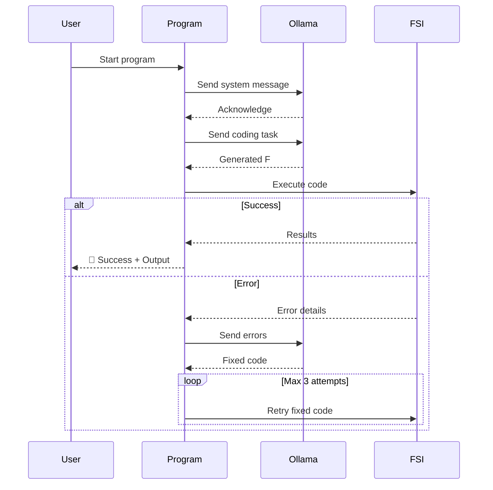

# IntelliFSharp

# 🚀 IntelliFSharp - F# Code Runner with LLM Feedback Loop  

<div align="center">
  
  
  
</div>

An AI-powered playground where your F# code gets **automatically tested and fixed**! This project uses Large Language Models (Ollama) to generate F# code, executes it in real-time, and sends errors back to the AI for auto-correction 🔄

> "It's like having a pair programmer who never sleeps! 😴➡️🤖"

## 🌟 Key Features
- **AI-Powered Code Generation** - Uses Ollama LLMs to write F# code
- **Real-Time Execution** - Runs code in F# Interactive (FSI) sandbox
- **Auto-Debugger** - Sends errors back to AI for automatic fixes
- **Smart Feedback Loop** - Up to 3 correction attempts
- **Emoji-Powered Logging** - Because debugging should be fun 🐛➡️✅

## ⚙️ How It Works


## 🚀 Getting Started

### Prerequisites
- [.NET 6+ SDK](https://dotnet.microsoft.com/download)
- [Ollama](https://ollama.ai/) (with at least one LLM installed)
- F# Interactive (`dotnet tool install -g fsi`)

### Installation
1. Clone the repository:
```bash
git clone https://github.com/pwrmind/IntelliFSharp.git
cd IntelliFSharp
```

2. Run the project:
```bash
dotnet run
```

### Configuration
Modify these constants in `Program.cs`:
```csharp
const string modelName = "deepseek-coder-v2:latest"; // Change to your preferred model
const int maxAttempts = 3; // Max auto-fix attempts
```

## 🧪 Example Run
```
📩 Sending system message...
✅ System message sent

📤 Sending task:
📝 Task: Write F# function calculating sum of squares from 1 to n

📥 LLM response:
Here's the F# code:
```fsharp
let sumOfSquares n = 
    [1..n] |> List.map (fun x -> x * x) |> List.sum

sumOfSquares 5;;
```

⚡ Executing block #1...
✅ stdout: 55
❗ stderr: 

🎉 Code executed successfully!
📋 Results:
📦 Block #1 result: 55
══════════════════════
```

## 🛠️ Customization Tips
1. **Change Tasks** - Modify the `taskMsg` variable for different challenges:
```csharp
var taskMsg = "📝 Task: Write F# function to calculate Fibonacci sequence";
```

2. **Add More Models** - Try different Ollama models:
```csharp
const string modelName = "codellama:7b"; // Smaller/faster model
```

3. **Extend Timeouts** - For complex tasks:
```csharp
bool completed = outputCompleted.WaitOne(30000); // 30s timeout
```

## 🤔 Why This Is Cool
- **Perfect for Learning F#** - See how AI solves programming challenges
- **Debugging Assistant** - Watch how LLMs fix their own mistakes
- **Prototyping Tool** - Quickly test algorithmic ideas
- **LLM Testing Platform** - Evaluate code generation quality

## 🚧 Known Limitations
- Requires running Ollama instance
- Simple error handling (WIP)
- FSI state persists between runs
- Currently supports single-file programs

## 🌈 Future Improvements
- [ ] Add support for multiple files
- [ ] Implement FSI session reset
- [ ] Add GUI interface
- [ ] Support other languages (Python, JavaScript)
- [ ] Add benchmark mode

---

Made with ❤️ and too much coffee ☕ by [Your Name Here]. Contribute and make it better!